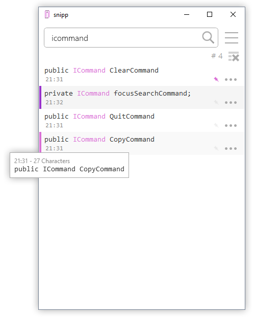

# snipp

A small, intuitive clipboard manager targeted towards developers, written in C# using WPF.

Listens to clipboard changes and automatically retrieves new (text) snippets.

## Usage

* Copy snippet: `Double-click`
* Copy selected snippet: `Ctrl+C` or `Enter`
* Pin selected snippet: `Ctrl+P`
* Delete selected snippet: `Delete`
* Focus search bar: `Ctrl+F`
* Focus and clear search bar: `Escape`
* Bring window to front (globally): `Ctrl+\``
* Quit: `Ctrl+Q`
